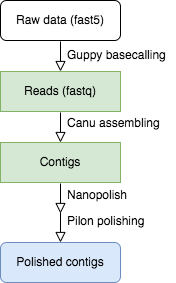

[](https://github.com/github/choosealicense.com/blob/gh-pages/LICENSE.md)

# Genome assembly with Nanopore reads

## Overview of an example workflow

This is an example workflow to assemble a chromosomal segment of a wheat blast fungal genome using the canu assembler.



## Installation

- __Running environment__: 
    - The workflow was constructed based on the __Linux system__ and the __slurm__ job scheduling system.

- __Required software and versions__: 
   
    - [Guppy v6.0.6](https://community.nanoporetech.com/downloads)
    - [Canu v2.2](https://github.com/marbl/canu)
    - [Nanopolish v0.13.2](https://github.com/jts/nanopolish)
    - [Pilon v1.24](https://github.com/broadinstitute/pilon) 
    - [conda](https://docs.conda.io/en/latest/)

Download the bio-protocol repository from GitHub.
```
git clone https://github.com/Bio-protocol/Nanopore_genome_assembly
cd Nanopore_genome_assembly
```

Download Guppy from Oxford Nanopore Community webpage. Guppy basecaller is frequently upgraded, so Guppy version 6.0.6 is just an example version. Users can register on nanoporetech.com to access the latest version of Guppy. 

```
# Example
pushd lib
curl -L -o ont-guppy-cpu_6.0.6_linux64.tar.gz https://mirror.oxfordnanoportal.com/software/analysis/ont-guppy-cpu_6.0.6_linux64.tar.gz
tar -xvzf ont-guppy-cpu_6.0.6_linux64.tar.gz
rm ont-guppy-cpu_6.0.6_linux64.tar.gz
popd
```
Download Pilon.
```
pushd lib
curl -L -o pilon-1.24.jar  https://github.com/broadinstitute/pilon/releases/download/v1.24/pilon-1.24.jar
popd
```

Create a conda environment and install packages.
```
conda create -n npasm
conda activate npasm
conda install -c bioconda -c conda-forge -c defaults canu=2.2 nanopolish=0.13.2
conda install -c bioconda samtools seqtk minimap2 bwa mummer4
conda install -c bioconda gatk
conda deactivate
```

## Input Data

Fast5 is a HDF5 file format to store the raw electrical signal level data of Oxford Nanopore sequencing reads. To produce a small dataset, a subset of fast5 data was extracted from the Nanopore Whole Genome Sequencing (WGS) data of the wheat blast fungal isolate B71 using the fast5_subset tool (nanoporetech). In detail, B71 Nanopore fastq reads (SRR12459118) called from fast5 were first aligned to the reference genome (B71Ref1.5) using minimap2. We then extracted fast5 data of half of the reads mapped to the region from 1,000,000 to 1,050,000 on chromosome 5 (chr5:1000000-1050000) of B71Ref1.5 using fast5_subset, which are saved in the following three fast5 files. These fast5 files are used for Guppy basecalling and Nanopolish polishing.

```
input/ont_fast5/fast5/B71example0.fast5
input/ont_fast5/fast5/B71example1.fast5
input/ont_fast5/fast5/B71example2.fast5
```

Illumina read data mapped to the same chromosome 5 region were extracted from the trimmed paired-end 250 bp Illumina reads of B71 (SRR6232156) using seqtk. Briefly, Illumina WGS reads were mapped to B71Ref1.5 using BWA-MEM. Reads mapped to the region chr5:1000000-1050000 of B71Ref1.5 were extracted. The extracted paired-end reads are used for Pilon polishing.

```
input/illumina_fastq/B71_example.illumina.R1.pair.fq.gz
input/illumina_fastq/B71_example.illumina.R2.pair.fq.gz
```

The ref.fasta contains the sequence of the region chr5:1000000-1050000 of B71Ref1.5.

```
input/ref.fasta 
```

## Major steps

The following script runs all steps together, from raw reads to the polished assembly, without using the Slurm scheduler.
```
cd workflow
sh local.asm.sh &
cd ..
```
The whole process of this example will take several hours to finish. (For testing, if you would like to skip the basecalling step, please modify the local.asm.sh.)

To run the code step by step, use the flowing command. 
 ### Guppy basecalling
 The fast5 data was basecalled using the software Guppy released by the Oxford Nanopore company. The basecalling step will take serval hours to finish. You can skip this step for testing. The output fastq files has been stored in the "cache/1o-basecall". 

```
cd workflow
sh local/1-basecall_local.sh
cd ..
```		
The Guppy basecalling is a computationally-intensive task. For a large dataset, the GPU version of Guppy is highly recommended. Alternatively, a Slurm-based CPU Guppy basecalling script using multiple threads as shown below can be implemented.

```
cd workflow
sh 1-basecall_slurm.sh 
cd ..
```

### Perform genome assembly using Canu assembler. 
For this example, the genome size is expected to be 50 kb (genomeSize=50k).  Nanopore reads with a length longer than 5 kb (minReadLength=5000) are loaded into the assembler. For alignments among reads, it requires the overlapping length longer than 1 kb (minOverlapLength=1000). Longest reads covering 60x coverage are corrected and used for the assembly (corOutCoverage=60).
```
cd workflow
sh local/2-asm_local.sh
cd ..
```
Canu assembler is a grid engine supported pipeline. To run the assembly on the supported grid scheduling system, the useGrid can be set to true ( useGrid=true). To submit the job on the slum system, run the following script.
```
cd workflow
sh 2-asm_slurm.sh
cd ..
```

### Polish draft assembled contigs using nanopolish.
First, Nanopore reads are indexed using “nanopolish index”. In this step, reads in the fastq format are linked to the fast5 raw data to allow Nanopolish to access the signal data. Second, fastq reads are aligned to the Canu draft assembly using minimap2. Third, variants are generated using “nanpolish variants”. Finally, a polished genome is generated from variants using nanopolish vcf2fasta.

```
cd workflow
sh local/3-nanopolish_local.sh
cd ..
```
Nanopolish is also a computationally-intensive job. A large genome assembly can be split to run the nanopolish variants in parallel. Here is the code developed to run through the Slurm scheduler.

```
cd workflow
sh 31-nanopolish_slurm.sh
cd ..
```
When the nanopolish step finishes, multiple polished contigs can be merged using the following code.
```
cd workflow
sh 32-nanopolish_merge_slurm.sh
cd ..
```
### Further polish the assembly using Pilon with Illumina reads.
First, Illumina short reads are aligned to the polished genome assembly from the Nanopolish step using BWA-MEM. Then, Pilon is used for further polishing.

```
cd workflow
sh local/4-pilon.sh
cd ..
```

### Compare the final genome assembly to the reference sequence.
```
cd workflow
sh local/5-qc.sh
cd ..
```

## Expected results


Check the comparison report.
```
tail -n +4 output/final_genome_qc/polished2ref.report |head 
```

Output 1:
```
                               [REF]                [QRY]
[Sequences]
TotalSeqs                          1                    1
AlignedSeqs               1(100.00%)           1(100.00%)
UnalignedSeqs               0(0.00%)             0(0.00%)

[Bases]
TotalBases                     50000               124197
AlignedBases          50000(100.00%)        50006(40.26%)
UnalignedBases              0(0.00%)        74191(59.74%)
```
In the report file, the number of query sequences is 1 and total bases of query sequences are 124,197bp, which indicates that the final genome assembly size is 124,197bp, and there is only one contig. Canu assembly report (cache/2o-demo.asmv0.1/demo.v0.1.report) can be used to check for the draft assembly statistics.

Check the aligned regions.
```
tail -n +4 output/final_genome_qc/polished2ref.aligned.txt 
```
Output 2:
```
  [S1]     [E1]  |     [S2]     [E2]  |  [LEN 1]  [LEN 2]  |  [% IDY]  | [TAGS]
=====================================================================================
     1    50000  |    41062    91067  |    50000    50006  |    99.98  | ref  tig00000001
```
The result indicated the 50 kb reference sequence can be aligned to tig00000001:41,062-91,067. The identity between the aligned reference and new assembly sequences is 99.98%. 

 Check the variants between the reference and the new assembly.
```
tail -n +4 output/final_genome_qc/polished2ref.variants.txt
```
Output 3:
```
    [P1]  [SUB]  [P2]      |   [BUFF]   [DIST]  |  [R]  [Q]  | [FRM]  [TAGS]
================================================================================
     531   . T   41593     |        0      531  |    0    0  |  1  1  ref	tig00000001
     531   . T   41594     |        0      531  |    0    0  |  1  1  ref	tig00000001
     531   . T   41595     |        0      531  |    0    0  |  1  1  ref	tig00000001
   23126   . A   64191     |        0    23126  |    0    0  |  1  1  ref	tig00000001
   23126   . A   64192     |        0    23126  |    0    0  |  1  1  ref	tig00000001
   23126   . A   64193     |        0    23126  |    0    0  |  1  1  ref	tig00000001
   25942   T .   67008     |        1    24059  |    0    0  |  1  1  ref	tig00000001
   25943   T .   67008     |        1    24058  |    0    0  |  1  1  ref	tig00000001
   46397   . T   87463     |        0     3604  |    0    0  |  1  1  ref	tig00000001
   46397   . T   87464     |        0     3604  |    0    0  |  1  1  ref	tig00000001
```
The 10 variants in the two sequences aligned region can be interpreted as 4 INDELs, which results in the 99.98% identity. INDEL is the common error source for long reads sequencing.


## License
It is a free and open source software, licensed under [MIT](https://github.com/github/choosealicense.com/blob/gh-pages/LICENSE.md).
